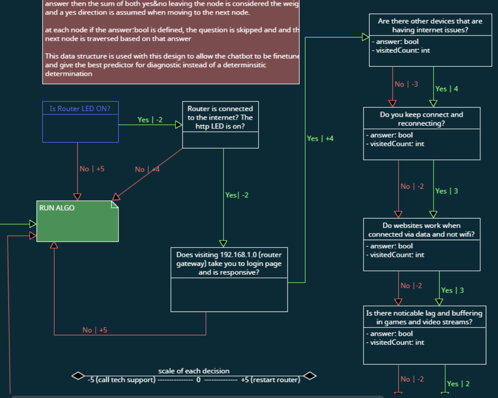

# Backend API

Flask backend application for the RouteThis take-home project.

## Prerequisites

- Python 3.7+
- pip (Python package installer)

## Setup and Installation

1. **Navigate to the backend directory:**

   ```bash
   cd backend-python
   ```

2. **Create a virtual environment:**

   ```bash
   python -m venv venv
   ```

3. **Activate the virtual environment:**

   On Windows:

   ```bash
   venv\Scripts\activate
   ```

   On macOS/Linux:

   ```bash
   source venv/bin/activate
   ```

4. **Install dependencies:**

   ```bash
   pip install -r requirements.txt
   ```

5. **Set up environment variables:**
   Rename `.env.template` to `.env` and add your OpenAI API key.

## Running the Application

1. **Make sure your virtual environment is activated**

2. **Run the application:**
   ```bash
   python run.py
   ```

The application will start on `http://localhost:5173` if the `.env` is configured properly; otherwise, it will default to `http://localhost:5000`.

## API Endpoints

The application provides API endpoints accessible at `http://localhost:5173`. CORS is configured to allow requests from:

- `http://localhost:5173`
- `http://127.0.0.1:5173`

## Project Structure

```
backend/
├── app/
│   ├── __init__.py          # Flask app factory
│   ├── routes.py            # API route definitions
│   ├── logic.py             # Business logic
│   └── templates/
│       └── index.html       # Template files
├── requirements.txt         # Python dependencies
├── run.py                  # Application entry point
└── venv/                   # Virtual environment (created after setup)
```

## Development

The application runs in debug mode by default, which means:

- Automatic reloading when code changes
- Detailed error messages
- Debug toolbar (if configured)

## Troubleshooting

- Make sure your virtual environment is activated before running the application.
- Ensure all dependencies are installed with `pip install -r requirements.txt`.
- Check that no other application is using port 5151.

## Frontend Setup (React)

1. **Navigate to the frontend directory:**

   ```bash
   cd frontend-react
   ```

2. **Install dependencies:**

   ```bash
   npm install
   ```

3. **Start the development server:**
   ```bash
   npm run dev
   ```

The React application will run on `http://localhost:5173` by default. Make sure the Python backend is running and CORS is configured to allow requests from the frontend.

---

## Architecture

### Overview

At its core, the application prompts the user with questions and, based on their answers, presents follow-up questions or a diagnosis. While a decision tree is a common approach, it has limitations:

- **Decision trees** are deterministic and discrete, often ignoring relevant questions based on previous answers.
- In real-world diagnostics (like a doctor evaluating a patient), all relevant questions should be considered before making a judgment. This leads to a more probabilistic diagnosis rather than a deterministic one.

### Example Decision Tree

```
root: Are other devices having internet issues?
  ├── No: Is there noticeable lag or buffering in games and streams?
  └── Yes: Do they keep connecting or reconnecting?
```

In a strict tree, answering "No" at the root would ignore the other branch, which is not ideal for thorough troubleshooting.

### Why Use a Graph?

- **Weighted edges** can be added to a tree to represent the importance of each question, but many nodes may lead to the same outcome (e.g., "Run the algorithm and tally the scores/weights").
- Connecting all relevant edges to an "algorithm check" node effectively turns the tree into a graph.

### Efficiency

- Time complexity is not a major concern here. Diagnosing whether a user needs to restart their router only requires a few key questions, and a short O(n) traversal is sufficient.
- The main benefit of a graph approach is that the diagnostic graph can be fine-tuned and easily understood by customer service and networking teams who will design it.
- A graph can also handle "I don't know" answers by summing edge values and proceeding in the direction that suggests a router restart (since it's a low-cost action).

### Summary

- **Graph-based diagnosis** allows for more flexible, comprehensive, and probabilistic troubleshooting.
- It is easier to maintain and adapt for real-world customer support scenarios.

---


